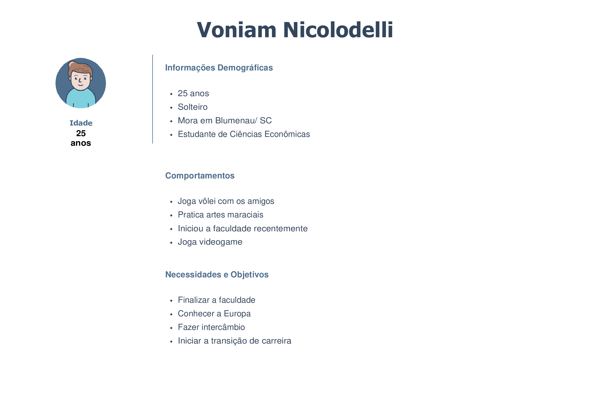
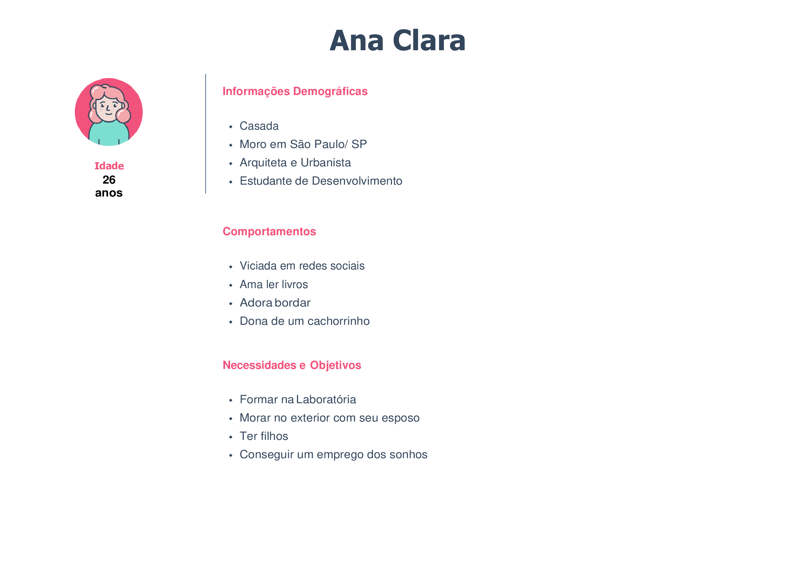
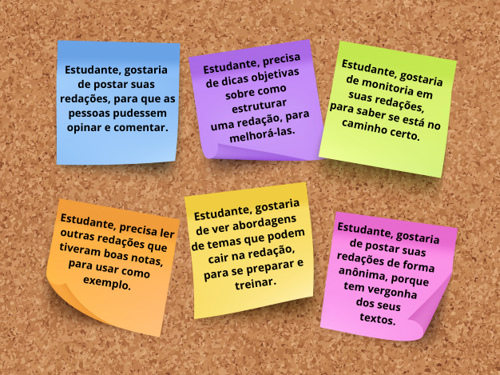

# Criando uma Rede Social

## Índice

- [1. Prefácio](#1-prefácio)
- [2. Conhecendo Nossos Usuários](#2-conhecendo-nossos-usuários)
- [3. Definição de Produto](#3-definição-de-produto)
- [4. Fluxograma](#4-fluxograma)
- [5. Interface do Usuário](#5-interface-do-usuário)
- [6. Teste de Usabilidade](#6-teste-de-usabilidade)
- [7. Ferramentas](#7-ferramentas)
- [8. Colocando a Mão na Massa](#8-colocando-a-mão-na-massa)
- [9. Considerações Finais](#9-considerações-finais)
- [10. Agradecimentos](#10-agradecimentos)
- [11. Autoras](#11-autoras)

---

## 1. Prefácio

A proposta do projeto é construir uma Rede Social sobre quaisquer assuntos, onde terá que permitir à qualquer usuário criar uma conta de acesso, logar-se com ela, criar, editar, deletar e dar likes em publicações. 

Ao se deparar com essa ideia, e após algumas reuniões e pesquisas com o grupo, decidimos criar um aplicativo, voltado à elaboração de redações. Visto que, a maioria das pessoas sentem dificuldades em como estruturar, diferenciá-la e até mesmo falar sobre o tema proposto.  

A redação hoje em dia conta muitos pontos nas provas do vestibular, concurso público e até no processo seletivo de uma empresa. E saber fazer uma boa redação para garantir uma vaga, é fundamental. 

K.A.T. é o aplicativo que faltava, para descomplicar a vida dos usuários, onde poderão postar suas redações, refazer, treinar, pedir ajuda, compartilhar dicas, comentar, curtir e receber feedbacks de melhorias seja de professores, como de amigos da rede. 

## 2. Conhecendo nossos Usuários 

### Principais Usuários 

Para todas as pessoas que irão prestar vestibular, concurso público e para todos aqueles que queiram se aperfeiçoar em suas redações de forma objetiva para fins profissionais e pessoais. E também professores que possam compartilhar dicas para melhorar as redações e comentar qualquer dúvida existente na rede. 

### Problemas 

Estudantes tem dificuldades em elaborar suas redações, fugindo do tema, não conseguem estruturar de forma correta, lógica e interligada. Faltam muitas dicas de temas e objetividade nos assuntos, além disso gostariam que suas redações fossem comentadas para saber onde estão errando ou se estão no caminho certo. 

## 3. Definição de Produto 

Alguns métodos de UX foram utilizados para o desenvolvimento do aplicativo: 

:small_blue_diamond: Personas criadas; 

:small_blue_diamond: Personas validadas com as entrevistas realizadas; 

:small_blue_diamond: História de usuário. 

### Personas 

 

### Entrevistas 
[colocar as imagens]

### História do Usuário 

 

:pushpin: **História de Usuário 1 -** “Estudante, gostaria de postar minhas redações, para que as pessoas pudessem opinar e comentar.” 

**Critérios de Aceitação:** 

:small_blue_diamond: Página de cadastro na plataforma;

:small_blue_diamond: Página para login na plataforma (e-mail e senha);

:small_blue_diamond: Página onde o usuário possa escrever uma publicação (input de texto e um botão enviar postagem);

:small_blue_diamond: Página onde todos da plataforma possam visualizar a publicação postada pelo usuário;

:small_blue_diamond: Input que permita a outros usuários comentarem a publicação e darem likes;

:small_blue_diamond: Função que permita ao usuário fazer logout do app.

:pushpin: **História de Usuário 2 -** “Estudante, precisa de dicas objetivas sobre como estruturar uma redação para melhorá-las.” 

**Critérios de Aceitação:** 

:small_blue_diamond: Página de cadastro na plataforma; 

:small_blue_diamond: Página para login na plataforma (e-mail e senha);  

:small_blue_diamond: No input de texto, quando o usuário for criar uma publicação, ter um filtro que sinalize que aquele post é relacionado à estrutura de redação.

:small_blue_diamond: O sinalizador irá aparecer no post > página de publicações. 

:small_blue_diamond: Função que permita ao usuário fazer logout do app. 

:pushpin: **História de Usuário 3 -** “Estudante, gostaria de monitoria em suas redações para saber se está no caminho certo.”  

**Critérios de Aceitação:**

:small_blue_diamond: Página de cadastro na plataforma; 

:small_blue_diamond: Página para login na plataforma (e-mail e senha);  

:small_blue_diamond: Página onde o usuário possa escrever uma publicação (input de texto e um botão enviar postagem); 

:small_blue_diamond: Página onde todos da plataforma possam visualizar a publicação postada pelo usuário; 

:small_blue_diamond: Input que permita a outros usuários comentarem a publicação e darem likes; 

:small_blue_diamond: Função que permita ao usuário fazer logout do app. 
 
:pushpin: **História de Usuário 4 -** “Estudante, precisa ler outras redações que tiveram boas notas, para usar como exemplo.” 

**Critérios de Aceitação:**

:small_blue_diamond: Página de cadastro na plataforma; 

:small_blue_diamond: Página para login na plataforma (e-mail e senha);  

:small_blue_diamond: No input de texto, quando o usuário for criar uma publicação, ter um filtro que sinalize que aquele post é uma redação. 

:small_blue_diamond: O sinalizador irá aparecer no post > página de publicações; 

:small_blue_diamond: Página onde todos da plataforma possam visualizar publicações de outros usuários; 

:small_blue_diamond: Visualizar as curtidas (contagem de likes) para determinado post; 

:small_blue_diamond: Poder ordenar por curtidas +++; 

:small_blue_diamond: Função que permita ao usuário fazer logout do app. 

:pushpin: **História de Usuário 5 -** “Estudante, gostaria de visualizar abordagens de temas que podem cair na redação, para poder separar e treinar.” 

**Critérios de Aceitação:**

:small_blue_diamond: Página de cadastro na plataforma; 

:small_blue_diamond: Página para login na plataforma (e-mail e senha);  

:small_blue_diamond: No input de texto, quando o usuário for criar uma publicação, ter um filtro que sinalize que aquele post é uma sugestão de temas para redação de vestibular; 

:small_blue_diamond: O sinalizador irá aparecer no post > página de publicações;

:small_blue_diamond: Página onde todos da plataforma possam visualizar publicações de outros usuários; 

:small_blue_diamond: Função que permita ao usuário fazer logout do app. 

:pushpin: **História de Usuário 6 -** “Estudante, gostaria de postar suas redações de forma anônima, porque tem vergonha de seus textos.” 

**Critérios de Aceitação:** 

:small_blue_diamond: Página de cadastro na plataforma; 

:small_blue_diamond: Página para login na plataforma (e-mail e senha);  

:small_blue_diamond: No input de texto, quando o usuário for criar uma publicação, ter um filtro que sinalize que ao postar, o usuário não quer que apareça seus dados no documento; 

:small_blue_diamond: Post ir para a página de publicações com perfil anônimo (imagem de anônimo e nome User, por exemplo); 

:small_blue_diamond: Página onde todos da plataforma possam visualizar publicações de outros usuários; 

:small_blue_diamond: Função que permita ao usuário fazer logout do app. 

### Definição de pronto 

**Criação e login de conta de usuário** 

Login com Firebase: 

:small_blue_diamond: Para o login e postagens na timeline, o uso de Firebase Authentication e Cloud Firestore.

:small_blue_diamond: O usuário deve poder criar uma conta de acesso ou autenticar-se com conta de e-mail e senha e também com uma conta do Google. 

Validações: 

:small_blue_diamond: Somente usuários com contas válidas têm acesso permitido. 

:small_blue_diamond: Não haver usuários repetidos. 

:small_blue_diamond: A conta do usuário deve ser um e-mail válido. 

:small_blue_diamond: O que o usuário digita no campo de senha (input) deve ser secreto. 

Comportamento: 

:small_blue_diamond: Quando o formulário de registro ou login é enviado, ele deve ser validado. 

:small_blue_diamond: Se houver erros, mensagens descritivas devem ser exibidas para ajudar o usuário. 

**Timeline:**  

Validações: 

:small_blue_diamond: Ao publicar, deve ser validado se há conteúdo no input. 

Comportamento: 

:small_blue_diamond: Ao recarregar o aplicativo, é necessário verificar se o usuário está logado antes de exibir o conteúdo.

:small_blue_diamond: Conseguir publicar um post.

:small_blue_diamond: Poder dar e remover likes em uma publicação. Máximo de um por usuário. 

:small_blue_diamond: Visualizar contagem de likes. 

:small_blue_diamond: Poder excluir uma postagem específica.

:small_blue_diamond: Solicitar confirmação antes de excluir um post. 

:small_blue_diamond: Ao clicar em editar um post, você deve alterar o texto para um input que permite editar o texto e salvar as alterações. 

:small_blue_diamond: Ao salvar as alterações, você deve voltar ao texto normal, mas com a informação editada. 

:small_blue_diamond: Ao recarregar a página, poder ver os textos editados. 

**Testes**

:small_blue_diamond: Passar de 70% a 100% nos testes unitários; 

:small_blue_diamond: Responsividade;

:small_blue_diamond: Teste de experimentação de aplicativo com os usuários.

## 4. Fluxograma

## 5. Interface de Usuário  

[Imagens dos protótipos] 

## 6. Teste de Usabilidade 

[apresentar dados] 

## 7. Ferramentas 

:hammer: HTML5 

:hammer: CSS3 

:hammer: Vanilla JavaScript 

## 8. Colocando a Mão na Massa  

[explicando como utilizar o app e inserir imagens] 

Clica aqui, para testar :rocket: 

## 9. Considerações Finais 

## 10. Agradecimentos 

## 11. Autoras 

:small_blue_diamond: Alessandra Alves | [GitHub - Alessandra](https://github.com/ale-alves)

:small_blue_diamond: Kauana Agostini  | [GitHub - Kauana](https://github.com/kauanaagostini)

:small_blue_diamond: Thaís Alencar | [GitHub - Thaís](https://github.com/alencartha) 
